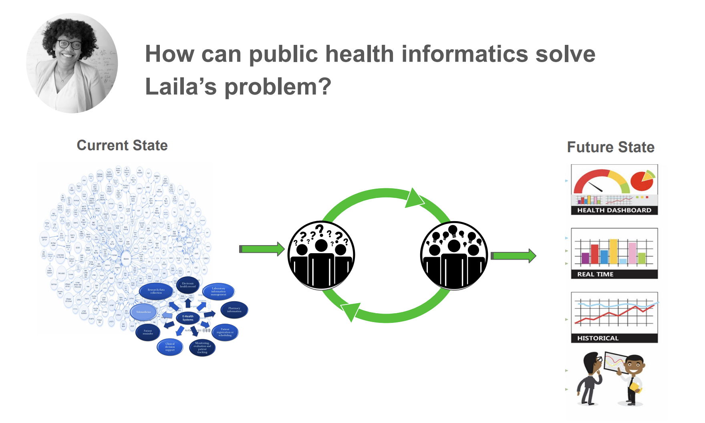
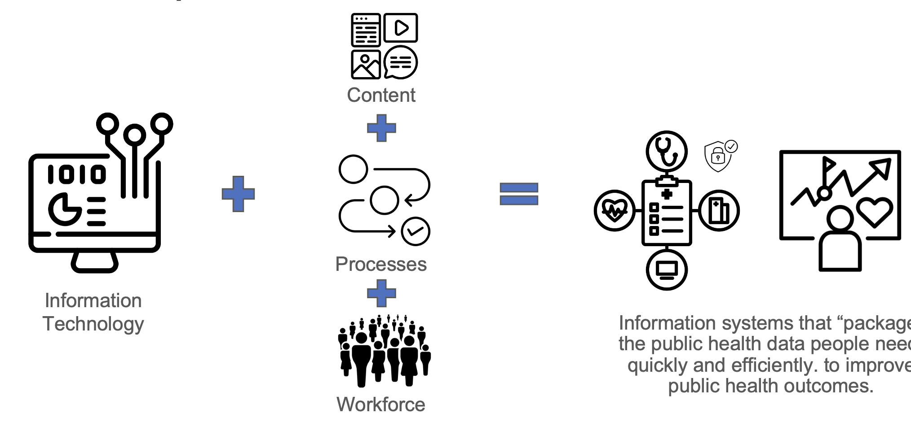
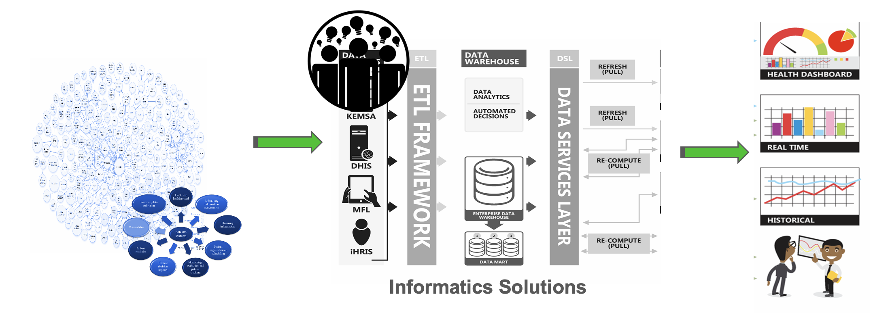
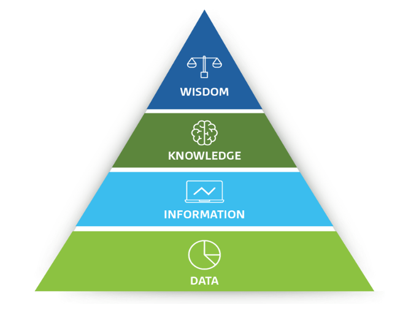
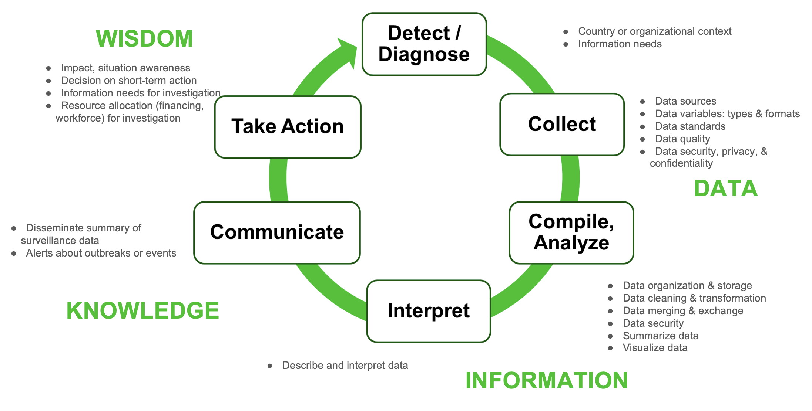
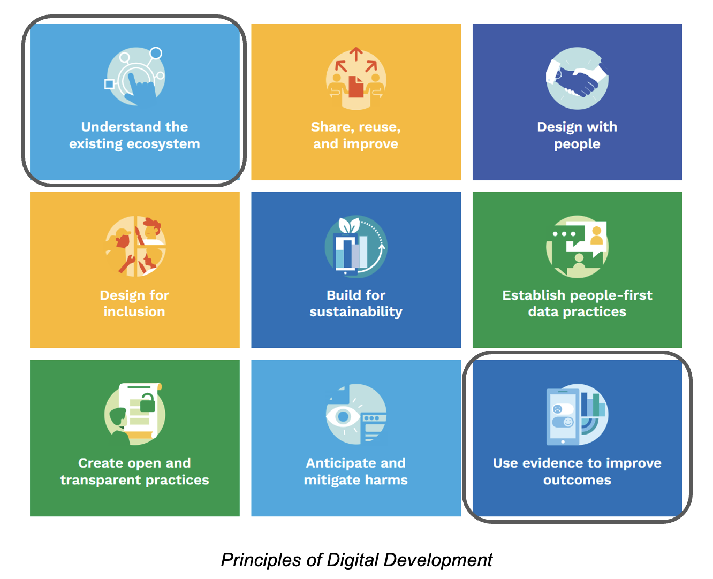

# Unit 1: Introduction to Informatics for Epidemiology
### 1.1 Learning Objectives

- Describe how key informatics principles, systems, and tools can improve public health surveillance and outbreak investigations.
- Explain how the transformation of raw data to meaningful information, knowledge, and wisdom necessary supports data-driven action.
- Match your country’s health information system landscape and current trends to surveillance system components.


### 1.2 Unit Slides

<iframe class="slides" width="800px" height="480px"
        src="https://docs.google.com/presentation/d/1vhyn9EhvMrGn6K4rXG80pnbu31N1YddV/embed?start=false&loop=false&delayms=3000" frameborder="0" width="100%" height="500" allowfullscreen="true" mozallowfullscreen="true" webkitallowfullscreen="true"></iframe>

### 1.3 Laila’s Problem: Data Overload

As a field epidemiologist, Laila is always on the lookout for potential outbreaks.

**Her challenge?**

- Laila has a large volume of data coming to her at full speed from a
wide variety of sources.
- Locating, cleaning, and transforming the data she needs into
information she can use can be time-consuming. She has many
demands on her time.

**How many of you can relate to this same challenge?**

**How are you solving this problem?**



## 2. What is Public Health Informatics?



Public health informatics is the systematic application of information, computer science, and
technology in areas of public health, (surveillance, prevention, preparedness, and health promotion)
to capture, manage, analyze, disseminate, and use information to improve population-level health
outcomes.

Public health informatics uses information technology to design and run information systems that “package” and securely send public health data to the right people, at the right place, and on time.

### 2.1 Workforce: What do informaticians do?

Architects plan buildings with the needs of a community in mind.

Informaticians plan, maintain, and improve data systems that produce the information public health professionals need to make sound public health decisions.



**Lets take a moment and watch this video**

<iframe class="video" width="800px" height="480px"
        src="https://www.youtube.com/embed/fLUygA8Hpfo?rel=0"
        allowfullscreen></iframe>

## 3. Transforming Data into Wisdom



**Wisdom**: the ability to make well-informed decisions and take effective actions based on understanding of the underlying knowledge

**Knowledge**: analyzed and interpreted information to uncover patterns, trends & relationships. Uncovers “how” and “why.”

**Information**: organized, structure and contexualized data. Answers “person,” “place,” and “time.”

**Data**: raw unprocessed facts and figures. Holds limited value in isolation.

### 3.1 Public Health Surveillance + Information Value Cycle



## 4. Informatics Principles



By strategically applying informatics principles, systems and tools, we use evidence to solve public health problems in our current, existing ecosystem and improve health outcomes


**Digital ecosystems are defined by:**

- Culture, gender and social norms,
- Political environment, economy, technology infrastructure and
- Other factors that can affect an individual’s ability to access and use a technology

Understanding the existing digital ecosystem can help determine if and how epidemiologists should:

- Engage with and adapt existing informatics solutions.
- Support local informaticians and actors taking action to tackle key challenges


This includes understanding existing:

- Access to devices, connectivity, affordability, digital literacy, and capacity strengthening opportunities so that initiatives are designed to accommodate or strengthen these realities.
- Government policies, national visions, sector policies/priorities/strategies, and efforts to expand foundational digital public infrastructure.

**How would you describe your current access to technology and connectivity in your work setting? Is it affordable? For whom?**


```{admonition} Additional Materials
:class: remove-from-content-only tip
This collection of video resources offers an in-depth look at public health informatics.
```

<iframe class="video" width="800px" height="480px"
        src="https://www.youtube.com/embed/Fzc3j8QG_Mw?rel=0"
        allowfullscreen></iframe>

## 5. Summary

- Informatics applies relevant information technology to content and processes that help epidemiologists use data to rapidly detect, diagnose, and take action to address public health emergencies.
- Informaticians specialize in translating data into information, which allows
epidemiologists to apply their knowledge and turn into wisdom to solve epidemiological problems.
- By applying informatics to the public health surveillance cycle, epidemiologists can extract greater value from the data available to them.
- Applying informatics principles enables epidemiologists to use informatics systems and tools more effectively